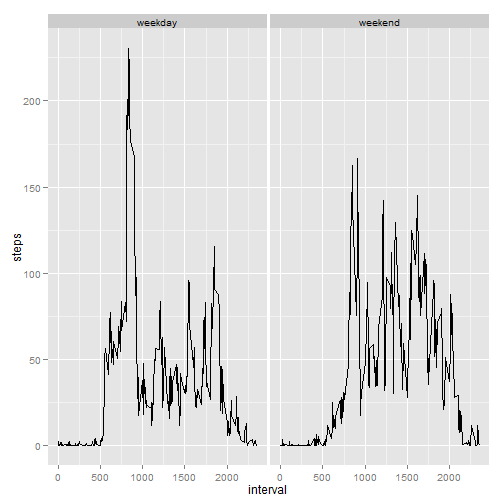

Assignment 1
============


We first load the packages we will use, and read the given table.


```r
library(reshape2)
library(timeDate)
library(ggplot2)
table<-read.csv("activity.csv")
```

We construct another table "Tidy", which summarizes the steps taken each day. Then we calculate the mean and median, and output a histogram.

```r
Melt <- melt(table,id=c("date"),measure.vars="steps", na.rm=TRUE)
Tidy <- dcast(Melt, date ~ variable,sum)
hist(Tidy$steps)
```

 

```r
mean(Tidy$steps)
```

```
## [1] 10766
```

```r
median(Tidy$steps)
```

```
## [1] 10765
```

We construct another table that summarizes the number of steps taken, averaged across all days, and proceed to output the time series plot.

```r
Melt2 <- melt(table,id=c("interval"),measure.vars="steps",na.rm=TRUE)
Tidy2 <- dcast(Melt2, interval ~ variable,mean)
plot(Tidy2$interval, Tidy2$steps, type = "l")
```

 

The interval that contains the maximum number of steps:

```r
Tidy2[Tidy2$steps==max(Tidy2$steps),][[1]]
```

```
## [1] 835
```

We calculate the total number of missing values in the dataset.

```r
j<-!complete.cases(table$steps)
 sum(j)
```

```
## [1] 2304
```
We will fill in the missing values with the means calculated for each interval in the previous table.

```r
tablena<-table
for (i in 1:length(Tidy2$steps)){tablena[j,]$steps <- replace(tablena[j,]$steps, tablena[j,]$interval == Tidy2$interval[i], Tidy2$steps[i])}
```
In order to construct the desired histogram we manipulate the data as before. We then calculate the mean and median again.

```r
Melt3 <- melt(table,id=c("date"),measure.vars="steps", na.rm=TRUE)
Tidy3 <- dcast(Melt3, date ~ variable,sum)
hist(Tidy3$steps)
```

 

```r
mean(Tidy3$steps)
```

```
## [1] 10766
```

```r
median(Tidy3$steps)
```

```
## [1] 10765
```
We can observe that the median has changed and is now equal to the mean.

Now its time to tackle the last question. First we construct a table with the labels "weekday" and "weekend" using the timeDate package.

```r
tableweek<-tablena
dd<-isWeekday(tableweek$date)
dd[dd==TRUE]<-"weekday"
dd[dd==FALSE]<-"weekend"
tableweek$date<-dd
```
To make the plot we make use of the aggregate() function to create the factor variable and then create the time series plot.

```r
aggdata <-aggregate(tableweek$steps, by=list(tableweek$date,tableweek$interval), FUN=mean)
names(aggdata)<-c("day","interval","steps")
g <- ggplot(aggdata, aes(x = interval, y = steps),type="1") 
g + facet_wrap(~ day) + geom_line() 
```

 


